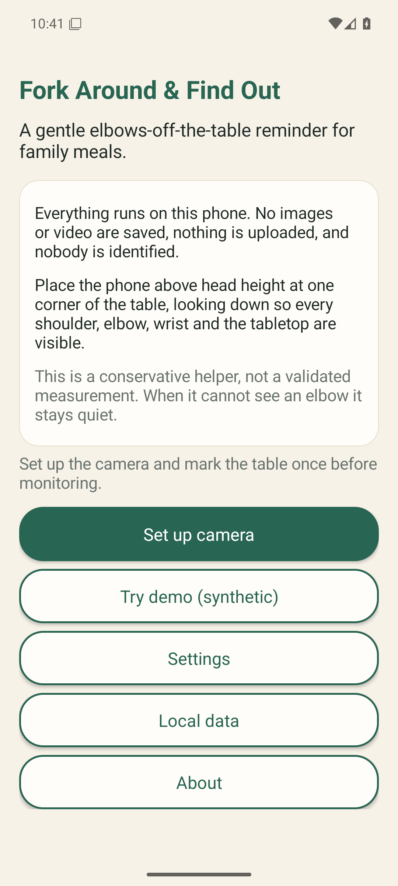
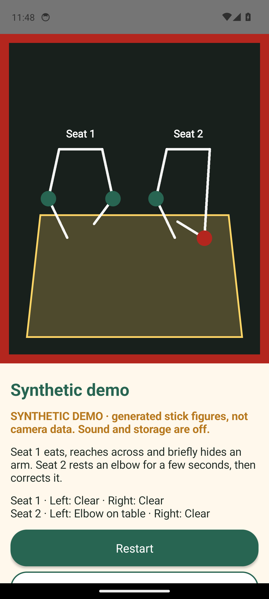
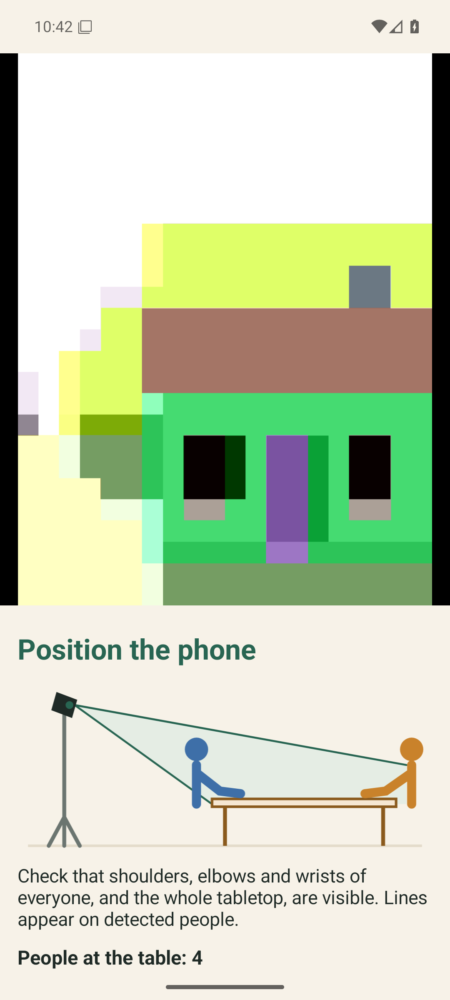
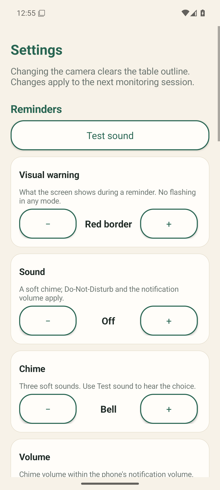
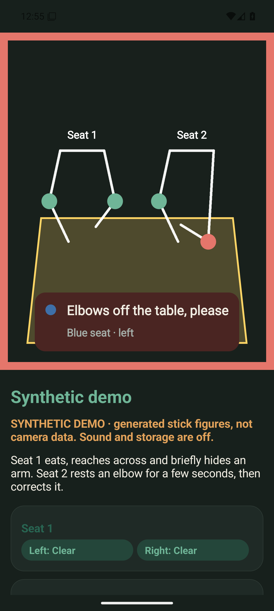
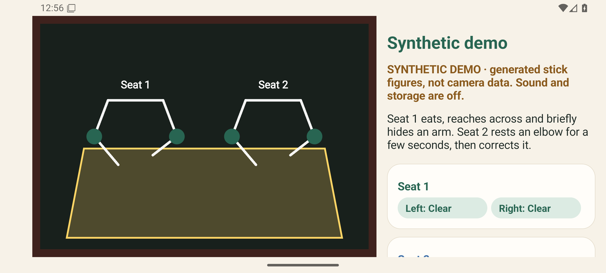

<!-- SPDX-FileCopyrightText: 2026 Marcel Petrick -->
<!-- SPDX-License-Identifier: GPL-3.0-or-later -->

# Fork Around & Find Out

[](https://github.com/marcelpetrick/ForkAroundAndFindOut/actions/workflows/pipeline.yml)
[](https://github.com/marcelpetrick/ForkAroundAndFindOut/releases/latest)
[](LICENSE)
[](docs/licensing.md#1-every-file-is-tagged-reuse-33)
[](docs/licensing.md#2-the-software-bill-of-materials)
[](detekt.yml)
[](build.gradle.kts)
[](https://developer.android.com/about/versions/14)
[](https://kotlinlang.org/)
[](https://developer.android.com/media/camera/camerax)
[](https://ai.google.dev/edge/mediapipe/solutions/vision/pose_landmarker/android)
[](localPipeline.sh)
[](localPipeline.sh)
[](https://github.com/marcelpetrick/ForkAroundAndFindOut/pkgs/container/forkaroundandfindout)
[](docs/architecture.md#privacy-by-construction)
[](app/src/main/res)

An offline Android app that watches a family dinner table through a phone camera and
gently reminds whoever rests an elbow on the table. It uses MediaPipe body landmarks,
a calibrated table outline and a conservative per-elbow temporal classifier, and it
stays quiet when it is unsure. Everything runs on the phone: no images are saved,
nothing is uploaded, nobody is identified. Written entirely in Kotlin.

**Author: Marcel Petrick. License: GPLv3 or later. Built with AI assistance.**

## Status

| Area | State |
| --- | --- |
| Camera, pose model, guided setup with visibility check, calibration, per-elbow detection, warnings, pause, meal summary, settings, diagnostics, training logs, replay tool | Implemented and tested (unit, Robolectric, emulator end-to-end on API 34 and 36) |
| Synthetic acceptance scenarios (vision §29) | Automated regression tests pass |
| Real phone, real table, real meals (false alarms per meal, recall) | **Not yet measured** — see [hardware validation](docs/hardware-validation.md) |
| Learned classifier, image classifier, depth | Conditional future work per the vision; needs real, consented sessions first |
| Raspberry Pi / multi-camera appliance | **Never** — out of scope by owner decision |

Version 1.0.0 is reserved for when the real-meal targets are met and recorded.

## Screenshots

Genuine screenshots of the running app (Android 14 emulator). The demo shows generated
stick figures, never camera footage; the setup screen shows the emulator's virtual camera.

| Welcome | Synthetic demo with warning | Camera setup with visibility check | Settings |
| --- | --- | --- | --- |
|  |  |  |  |

| Dark ("dim room") theme | Landscape |
| --- | --- |
|  |  |

## How it works

```text
camera (CameraX, 640×360 analysis) → MediaPipe Pose Landmarker (≤ 4 people, 33 landmarks)
  → seat tracking (no faces, no identity) → table-relative arm geometry + motion
  → conservative rule: stationary, bent, supported elbow on the table
  → per elbow: UNKNOWN / CLEAR / SUSPECT / VIOLATION with dwell, clearing and cooldown
  → warning: red border (or icon / tint / slow pulse) and an optional soft chime
```

A reminder needs about one second of steady evidence; reaching, passing food and brief
crossings do not trigger it. Hidden elbows are "Not visible", never "good posture". On a
set table a dish passed in front does not interrupt a reminder, a hand hidden behind a glass
keeps a clearly seen rest for up to 10 s, and an arm that stays hidden is named so the pot
can be moved ([detection](docs/detection.md#a-set-table-pots-plates-glasses)).
Start with the plain-language [C4 architecture and workflows](docs/c4-architecture.md).
Details: [architecture](docs/architecture.md), [detection rules](docs/detection.md),
[framework choice](docs/pose-frameworks.md), [UX](docs/ux.md).

## Camera placement

Put the phone **above head height at a corner of the table**, tilted down, so every
shoulder, elbow and wrist and the whole tabletop are visible (a shelf or a small tripod
works well). Avoid backlight. The setup's visibility check confirms the placement.

## Usage

1. **Set up camera**: set the number of people, pick the **Wide** lens if offered, and let
   the **visibility check** run for 10 s with everyone seated. It says what is wrong
   (nobody, too few or too many people, arms hidden on the left/right, slow phone).
   **Restart the 10-second check** once everyone has settled.
2. **Mark table**: tap the four tabletop corners; drag a corner to adjust, a loupe magnifies.
3. Optional **seats**: **Suggest seats** proposes one region per person from the table
   edges, with a live "people inside a seat" count; or tap them yourself.
4. **Start dinner** (also a launcher shortcut). A short grace period, then reminders.
   **Pause** is always one tap, or hold **volume-down**. A warm or slow phone is offered
   the Lite model in one tap; "nobody visible for a while" offers to recalibrate.
5. Adults can open **diagnostics**: FPS, latency, processor, scores, *False alarm*
   (silences and rests reminders for 30 s), *Missed violation*, and the opt-in
   **training mode**.
6. **Stop** shows a friendly summary: time, reminders, longest calm stretch, per seat.

Try it without a camera: **Try demo (synthetic)**. Without a phone: run it in an
[emulator on a laptop](docs/emulator.md).

## Settings

Grouped into **Reminders** (visual warning, sound off / once / repeat / continuous, chime
Bell / Marimba / Glass, volume with *Test sound*, repeat interval, start grace),
**Sensitivity** (presets Conservative / Normal / Responsive plus the raw evidence
threshold, warning delay, clearing delay and cooldown), **Camera and model** (people 1–4,
rear lens Wide/Main/Tele, model Full/Lite, processor CPU / GPU experimental with automatic
CPU fallback) and **Data** (skeleton overlay, session statistics, local data). Changing
the lens clears the calibration. The app follows the system language (English, German) or
a per-app language on Android 13+.

## Privacy

- Frames are processed in memory and discarded; no image or video is ever written.
- The app has **no internet permission**. MediaPipe ships a Google telemetry uploader;
  its network access is removed from the manifest (builds before 0.9.26 did not do this —
  see `plan.md`). A test fails if any network or storage permission reappears.
- Local data is limited to settings, feedback taps, opt-in statistics and opt-in
  training logs of body landmarks. Export and delete are on the *Local data* screen.
  Backup is disabled. See [data](docs/data.md).

## Training mode, data and replay

Training mode records the session's landmarks and your labels (NORMAL, LEFT, RIGHT, BOTH,
false alarm, missed) into a local gzip log. On a computer:

```sh
scripts/replay.sh demo-log /tmp/demo.jsonl.gz 3     # labelled synthetic session
scripts/replay.sh replay /tmp/demo.jsonl.gz          # reminders, false alarms, recall
scripts/replay.sh replay --trigger-ms 1500 meal-*.jsonl.gz   # tuning experiment
```

Evaluate by whole sessions, never by frames of the same meal ([data.md](docs/data.md)).

## Setup

Requirements: Java 21, Android SDK (`ANDROID_HOME`, platform 37 and build-tools),
Python 3, ShellCheck, Docker (optional, for the Docker stage), an emulator or phone
(optional, for end-to-end tests). Step-by-step emulator setup on a laptop (Linux, macOS,
Windows): [docs/emulator.md](docs/emulator.md).

```sh
git clone https://github.com/marcelpetrick/ForkAroundAndFindOut.git
cd ForkAroundAndFindOut
./localPipeline.sh --noRun            # downloads the pinned models, checks, tests, builds
adb install -r app/build/outputs/apk/debug/app-debug.apk
```

Release APKs are arm64-only and signed with the project key when it is configured
([signing](docs/docker.md#release-signing)); fingerprint
`AA:F8:58:04:C1:50:BB:DF:83:8A:28:49:B1:5A:7A:F3:F8:A9:74:7F:08:3E:A0:82:47:33:7A:10:7A:86:5A:E0`.

## Testing

| Level | Command | Covers |
| --- | --- | --- |
| JVM unit | `./gradlew :detection:test :core:test :tools:test` | geometry, rules, seat tracking, temporal filter, acceptance scenarios, monitor budgets, visibility check, session logs, replay |
| Robolectric | `./gradlew :app:testDebugUnitTest` | every screen flow, calibration, alarms, pause, stale data, permissions, storage, export, German locale, privacy guard |
| Coverage | `./gradlew :app:koverHtmlReportAll` | merged over all modules; gate ≥ 95 % lines (currently 98 %) |
| End-to-end | `scripts/emulator.sh && ./gradlew :app:connectedDebugAndroidTest` | real MediaPipe models offline (CPU, and a GPU request with fallback), UI flows with real touches on the emulator camera; verified on API 34 and API 36 |
| Docker | `scripts/docker-smoke.sh` | image serves APK with correct type and checksum, license, notices |

## Pipeline and CI

`./localPipeline.sh` runs numbered stages — models, ShellCheck, Python and chime check,
whitespace, the **lint suite** (REUSE/SPDX, ruff, yamllint, xmllint, hadolint, actionlint,
markdownlint in pinned containers), ktlint, **detekt**, Android lint (warnings are errors),
unit tests with merged coverage (**gate ≥ 95 % lines**), APK builds, **SBOM**, end-to-end
tests, Docker smoke test, coverage report, app launch — and prints a PASS/FAIL/WARN/SKIP
summary. `--help` lists the options (`--noRun`, `--noOpen`,
`--e2e auto|required|skip`, `--docker …`, `--report-dir`). GitHub Actions runs the same
script inside an API 34 emulator with end-to-end and Docker required, signs the release
from repository secrets, uploads APKs and reports, publishes the image to GHCR and, for
`v*` tags, creates a GitHub release with the APK, its SHA-256 and the CycloneDX SBOM. All scripts: [docs/scripts.md](docs/scripts.md).

## Docker and GHCR

The phone does the monitoring; Docker distributes the app. A small pinned nginx image
serves the signed APK, its SHA-256, the license and notices:

```sh
docker run --rm -p 8080:8080 ghcr.io/marcelpetrick/forkaroundandfindout:latest
# open http://<this-computer>:8080 on the phone and download the APK
```

Details: [docs/docker.md](docs/docker.md).

## Roadmap (conditional, per the vision)

1. Real-phone validation and meals (the protocol in [hardware validation](docs/hardware-validation.md)).
2. Threshold tuning by replaying held-out real sessions.
3. A small learned landmark classifier once enough labelled sessions exist.
4. Only if landmarks prove insufficient: a local elbow-image classifier; optional depth.

Not planned, ever: a Raspberry Pi or multi-camera appliance (owner decision).

## License and notices

GPL-3.0-or-later ([LICENSE](LICENSE)). Every file carries SPDX tags (REUSE 3.3, checked in
CI). The release SBOM lists every bundled component; the in-app About screen shows the same
list with licences, the required notices and the full licence texts. Summary:
[NOTICES.md](NOTICES.md); details and the GPLv3 review: [docs/licensing.md](docs/licensing.md). Planning history: [plan.md](plan.md) (ledger) and
[plan_v2](plan_v2/plan_v2.md) (review and plan of record); original [vision](vision.md);
[working rules](agents.md).
