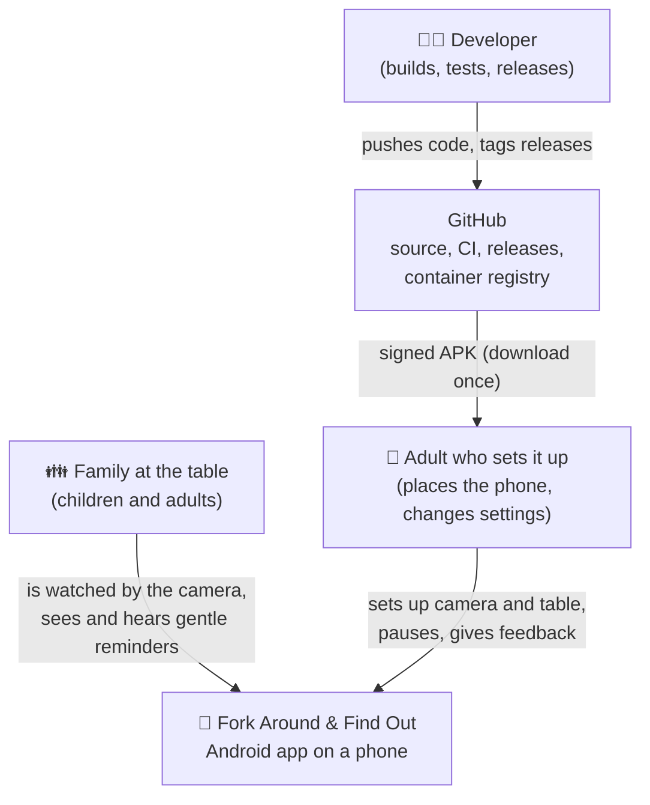
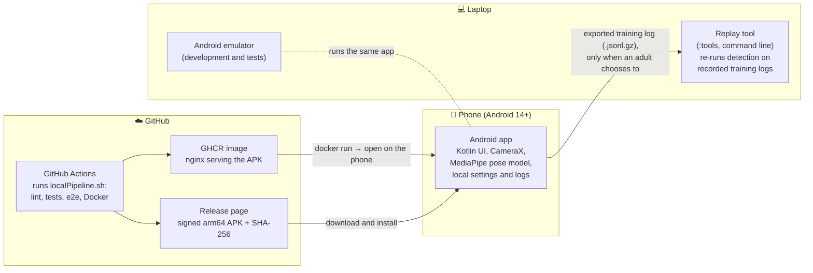
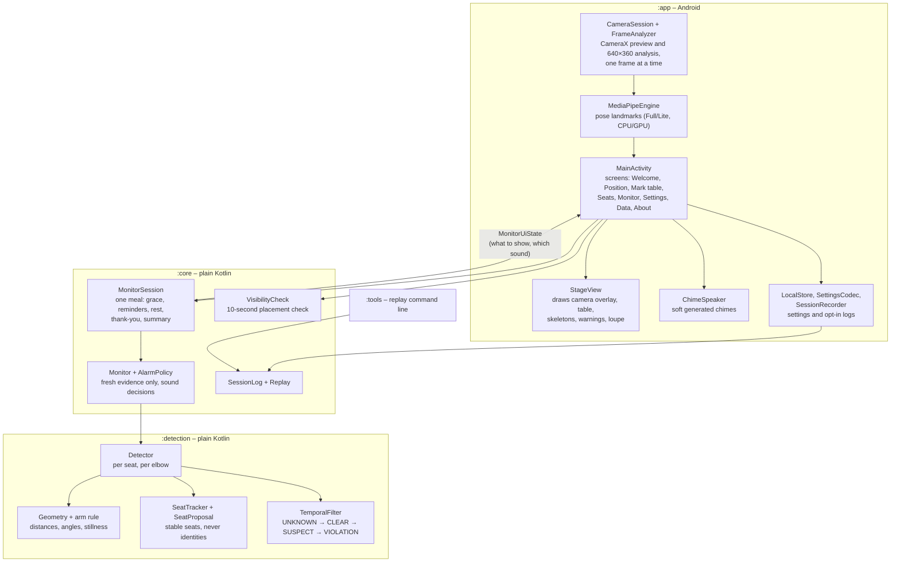
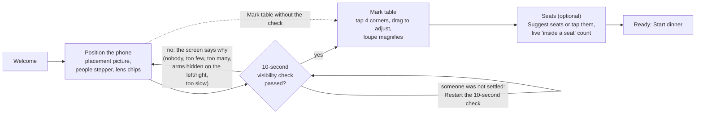
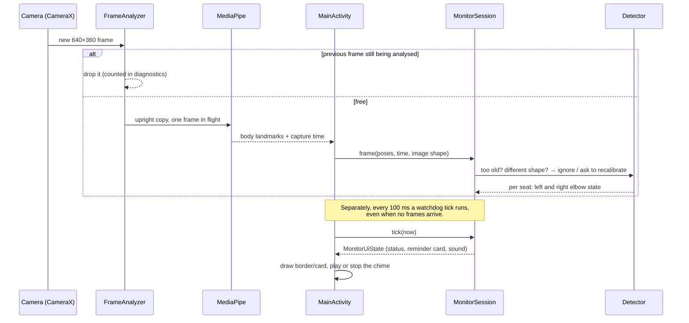
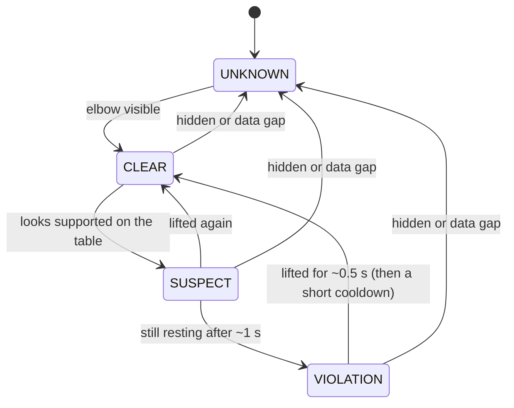
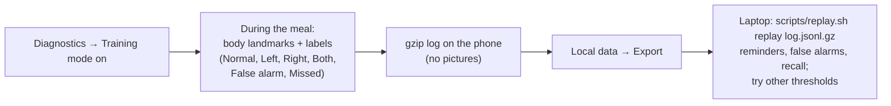
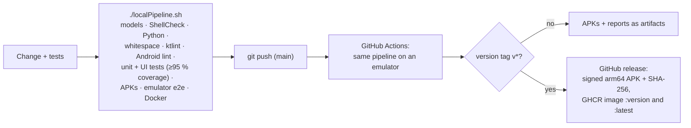

# How Fork Around & Find Out works (C4 architecture)

Copyright (C) 2026 Marcel Petrick. SPDX-License-Identifier: GPL-3.0-or-later.

This page explains the app from the outside in, in four steps. Each step zooms in a little
further, following the [C4 model](https://c4model.com/):

1. **Context** – who uses the app and what it talks to.
2. **Containers** – the separately running or shipped pieces.
3. **Components** – the main parts inside the Android app.
4. **Workflows** – what happens, step by step, during setup, a meal, and a release.

The last section is the **everyday workflow for the family**. Read it first if you only want
to use the app. The deeper technical notes live in [architecture](architecture.md),
[detection](detection.md) and [data](data.md).

## The idea in one paragraph

A phone stands at a corner of the dinner table. Its camera sees everyone's arms. A body-pose
model (Google's MediaPipe) finds shoulders, elbows and wrists in each picture. Our own small,
careful rule then asks, for every elbow: *is it resting on the tabletop, and has it stayed
there for about a second?* If yes, the screen shows a red border and a friendly card
("Elbows off the table, please · Blue seat · left"), optionally with a soft chime. When the
elbow lifts, the reminder fades and a short "Thank you!" appears. Pictures never leave the
phone's memory: nothing is saved, nothing is uploaded, nobody is identified.

## 1. Context – the app and its surroundings

What matters here:

- The app has **no internet permission**. After installation it never talks to anything.
- GitHub is only involved in building and downloading the app, not in running it.

## 2. Containers – the pieces that are built and shipped

| Container | What it is | Why it exists |
| --- | --- | --- |
| Android app | The product. Everything happens here. | Camera, detection and reminders on the phone itself. |
| Replay tool | A small JVM command-line program. | Tune detection thresholds on recorded meals without a phone. |
| GitHub Actions | The same `localPipeline.sh` that developers run. | Every change is formatted, linted, tested (unit, UI, emulator) and packaged. |
| Release APK and GHCR image | The downloadable app, and a tiny web server that hands it out. | Easy installation on the family phone. |

## 3. Components – inside the Android app

The code is split into four Gradle modules. The two in the middle contain all the decisions
and have no Android code at all, so they are tested quickly and thoroughly on a normal JVM.

How to read it: **`:app` only shows things**. It passes camera results down and renders the
answer that comes back. **`:core` decides** what the screen should say and which sound to
play. **`:detection` measures** each elbow.

## 4. Workflows

### 4.1 Setting up (once per table and phone position)

The table outline is stored in the camera image's own coordinates, together with the
picture's shape and rotation. If the lens or orientation changes, the app notices and asks
for a new outline instead of guessing.

### 4.2 What happens with every camera frame (about 10–30 times a second)

The watchdog matters: if the camera stalls, the evidence goes stale and the reminder stops
by itself. **Missing evidence never causes a reminder.**

### 4.3 How one elbow becomes a reminder

"Looks supported" means all of these at once: the elbow is on or just inside the table
outline, the arm is bent, the upper arm points down, and the arm is still. Reaching for
the salt, passing a plate or a brief touch does not qualify.

A **reminder** is shown while any elbow is in VIOLATION, except

- during the **start grace** (a few seconds after Start or Resume),
- while **paused** (Pause button, or hold volume-down),
- for 30 seconds after an adult taps **False alarm**,
- when the phone is **too slow** to give trustworthy evidence.

### 4.4 Training data and replay (optional, adults only)

### 4.5 From a code change to a public release

## 5. The everyday workflow for the family

### First time (about five minutes)

1. Install the APK from the GitHub release on an Android 14 (or newer) phone.
2. Put the phone **above head height at a corner of the table**, tilted down. A shelf or a
   small tripod works well. Avoid a bright window behind the table.
3. Open the app and tap **Set up camera**. Allow the camera.
4. Set the number of people with **−/+**. If the phone has several lenses, pick **Wide**.
5. Everyone sits as they would during a meal. The **10-second check** tells you when all
   shoulders, elbows and wrists are visible. If someone was still moving, tap
   **Restart the 10-second check**.
6. **Mark table**: tap the four corners of the tabletop. Drag a corner to fine-tune.
7. **Seats** (optional): tap **Suggest seats** and check that everyone counts as "inside a
   seat", or skip this step.

### Every dinner

1. Put the phone in the same place and tap **Start dinner**. The launcher shortcut
   *Start dinner* (long-press the app icon) does the same.
2. Eat. If an elbow rests on the table for about a second, the screen turns red at the
   edges and shows which seat and side. Lift it and the reminder goes away.
3. Need a break? Tap **Pause**, or hold **volume-down**, without picking up the phone.
4. Wrong reminder? An adult opens **Adult diagnostics** and taps **False alarm**. The app
   goes quiet for 30 seconds.
5. Tap **Stop** at the end. The welcome screen shows a friendly summary: time, number of
   reminders, the longest calm stretch, and reminders per seat colour.

### When something is off

| The app says | What to do |
| --- | --- |
| "Nobody has been visible for a while. Has the phone moved?" | Tap **Recalibrate camera** and mark the table again. |
| "The phone is getting warm" or "Processing is slow" | Tap **Use the Lite model**. Dinner continues. |
| "The camera view changed, so the table outline no longer fits" | Run the setup again; the old outline no longer fits the picture. |
| "Camera permission is needed" | Tap **Open app settings** and allow the camera. |

### What the app does not do

- It does not save or send any picture or video.
- It does not recognise who someone is. Seats are colours (Green, Blue, Orange, Purple).
- It is a gentle helper, not a measurement. When it cannot see an elbow, it stays quiet.
